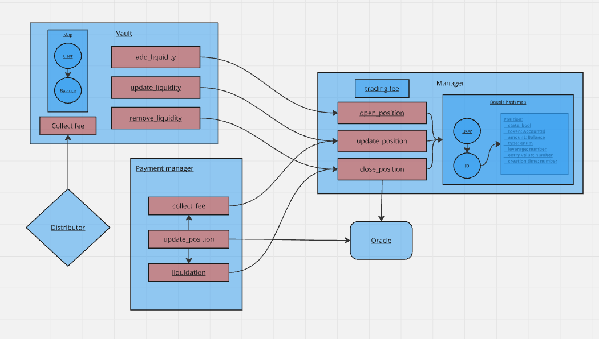

# Dahzbog

Introducing Dazhbog, the pioneering perpetual futures trading platform built exclusively on Polkadot's groundbreaking ecosystem. Born out of innovation and propelled by the collaborative spirit of a hackathon.

Dazhbog's perpetual futures contracts offer unparalleled flexibility, enabling traders to capitalize on price movements without the constraints of expiration dates. Whether hedging against market volatility, speculating on asset prices, or diversifying their investment portfolios, traders can leverage Dazhbog's perpetual futures contracts to pursue their trading objectives with precision and agility.

At its core, Dazhbog embodies the ethos of innovation and collaboration that defines the Polkadot community.

Experience the future of perpetual futures trading with Dazhbog– where innovation meets opportunity in the dynamic world of decentralized finance on Polkadot.

# Dazhbog: Decentralized Perpetual Futures on Polkadot

Dazhbog is a decentralized perpetual futures exchange built on Polkadot for the Polkadot Prodigy hackathon. It utilizes ink! smart contracts to facilitate peer-to-peer margin trading of perpetual contracts.

## Getting Started

To interact with Dazhbog, you'll need to have ink! and Cargo installed on your system. Here's a quick guide:

1. **Installation:**

In addition to Rust, installation requires a C++ compiler that supports C++17.
Modern releases of gcc and clang, as well as Visual Studio 2019+ should work.

-   Step 1: `rustup component add rust-src`.

-   Step 2: `cargo install --force --locked cargo-contract`.

-   Step 3: Install dependencies for linting.

    -   (MacOS) `brew install openssl`
    -   ```
        export TOOLCHAIN_VERSION=nightly-2024-02-08
        rustup install $TOOLCHAIN_VERSION
        rustup component add rust-src --toolchain $TOOLCHAIN_VERSION
        rustup run $TOOLCHAIN_VERSION cargo install cargo-dylint dylint-link
        ```
You can always update the `cargo-contract` binary to the latest version by running the Step 2.

3. **Clone this repository:**

   ```bash
   git clone https://github.com/rastkocbs/dazhbog.git

4. **Build the project:**

   ```bash
   cd manager
   cargo contract build --release

## User Scenarios

### Longing an Asset (Win Scenario):

- User deposits funds (e.g., DOT) as collateral into the Dazhbog contract.
- User specifies the desired leverage (e.g., 5x) and the amount of perpetual contract to long (e.g., 100 USDC).
- Dazhbog automatically calculates the required margin based on the - leverage and contract size.
- User approves the margin transfer from their wallet to the contract.
- The contract creates a long position for the user, representing a leveraged bet on the price of USDC increasing.
- As the price of USDC goes up, the value of the user's position increases.
- User decides to close the position at a profit.
- Dazhbog calculates the profit based on the entry and exit price, considering leverage.
- User withdraws the initial collateral deposit and the earned profit from the contract.

### Longing an Asset (Loss Scenario):

- User follows steps 1-4 as in the win scenario.
- The price of USDC goes down instead of up.
- The value of the user's long position decreases.
- As the price falls further, the contract might require additional collateral from the user to maintain the minimum margin ratio (maintenance margin). This is called a margin call.
- User can either:
    - Deposit more funds to meet the margin call.
    - Close the position at a loss.
- If the user fails to meet the margin call, the contract will automatically liquidate their position. The user will lose their initial collateral deposit and any unrealized profits.

### Shorting an Asset (Win Scenario):

- User deposits funds (e.g., DOT) as collateral into the Dazhbog contract.
- User specifies the desired leverage (e.g., 5x) and the amount of perpetual contract to short (e.g., 100 USDC).
- Dazhbog borrows the USDC equivalent from the contract pool to facilitate the short position. The borrowed USDC is used to create a synthetic short position.
- User approves the collateral transfer from their wallet to the contract.
- The contract creates a short position for the user, representing a leveraged bet on the price of USDC decreasing.
- As the price of USDC goes down, the value of the user's position increases.
- User decides to close the position at a profit.
- The contract uses the borrowed USDC to buy back the shorted asset at the current market price.
- User repays the borrowed USDC with interest to the contract pool.
- User withdraws the initial collateral deposit and the earned profit from the contract.

### Shorting an Asset (Loss Scenario):

- User follows steps 1-4 as in the win scenario.
- The price of USDC goes up instead of down.
- The value of the user's short position decreases.
- The contract might require additional collateral from the user to maintain the minimum margin ratio.
- User can either:
    - Deposit more funds to meet the margin call.
    - Close the position at a loss.
- If the user fails to meet the margin call, the contract will automatically liquidate their position. The user will lose their initial collateral deposit and any unrealized profits. The contract will also use the user's collateral to buy back the shorted asset at a loss, potentially incurring additional debt.


### Usage




User deposits funds to Vault contract via Manager contract calling `open_position` function. Manager contract update storage mappings with info about position: `amount`,`leverage`,`entry_price`. Manager pings Oracle for price using `get_price` and calculate `liquidation_price`. 

Manager invoke `collect_margin_fee` on Payment Manager contract every 3h to collect calculated margin fee. 

Payment Manager calls `withdraw_funds`, `add_to_pool` or `remove_from_pool` functions on Vault contract to add assets, pay reward, close position or liquidate.

Payment Manager uses AMM's `swap` function to exchange assets.

